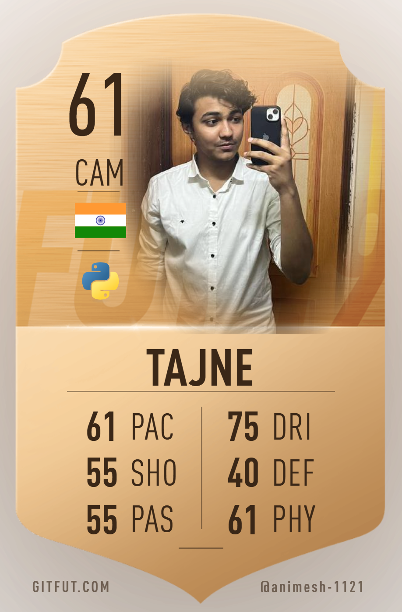

<h1 align="center">Hi 👋, I'm <b>Animesh Tajne</b></h1>

<h3 align="center">
💻 Computer Science & Business Systems Student <br>
📊 Data Analytics • 🤖 Machine Learning • 🌐 Full Stack Developer • ⚙️ Data Engineering Learner
</h3>

---

## 🧑‍💻 About Me

<table>
<tr>

<td width="60%" valign="top">

```json
{
  "name": "Animesh Tajne",
  "location": "Maharashtra, India",
  "role": "CSBS Student & Full Stack Developer",
  "education": "3rd Year Computer Science & Business Systems",
  "languages": [
    "Python",
    "R",
    "C",
    "C++",
    "SQL"
  ],
  "interests": [
    "Data Engineering",
    "Machine Learning",
    "Data Analytics",
    "Full Stack Development"
  ],
  "currently_learning": [
    "Apache Spark",
    "Kafka",
    "Big Data",
    "Cloud Technologies"
  ]
}
```

</td>

<td width="40%" align="center">

<a href="https://gitfut.com/animesh-1121?country=in">
  
</a>

<br>

<a href="https://gitfut.com/animesh-1121?country=in">
  
</a>

</td>

</tr>
</table>

---

# 📊 GitHub Stats

<div align="center">


<br>


</div>

---

# 🛠️ Tech Stack

### 💻 Languages

<p>

</p>

### 🌐 Web Development

<p>

</p>

### ⚙️ Backend

<p>

</p>

### 📊 Data Analytics

<p>


</p>

### 🛠️ Tools

<p>

</p>

---

# 🚀 Featured Projects

### 📊 Sales Analytics Dashboard
Interactive Power BI dashboard with SQL integration for business insights.

### 🤖 Machine Learning Projects
Prediction and classification models using Python, Pandas and Scikit-Learn.

### 🌐 MERN Stack Applications
Full-stack web applications with authentication and REST APIs.

### ⚙️ Data Engineering
Learning ETL pipelines, Apache Spark and Kafka.

---

# 🌱 Current Focus

- 📊 Data Engineering
- ⚡ Apache Spark
- ☁️ Cloud Technologies
- 🤖 Machine Learning
- 🌐 MERN Stack
- 🐳 Docker

---

## 🌐 Connect With Me

<div align="center">

<a href="https://www.linkedin.com/in/YOUR-LINK">

</a>

<a href="https://instagram.com/animeshtajne_">

</a>

<a href="mailto:work.animeshtajne@gmail.com">

</a>

<a href="https://medium.com/@YOUR_USERNAME">

</a>

<a href="https://gitfut.com/animesh-1121?country=in">

</a>

</div>

---

## 💭 Quote

> *"Code. Learn. Build. Repeat."*

---

<div align="center">


### ⭐ Thanks for visiting my profile!

</div>
